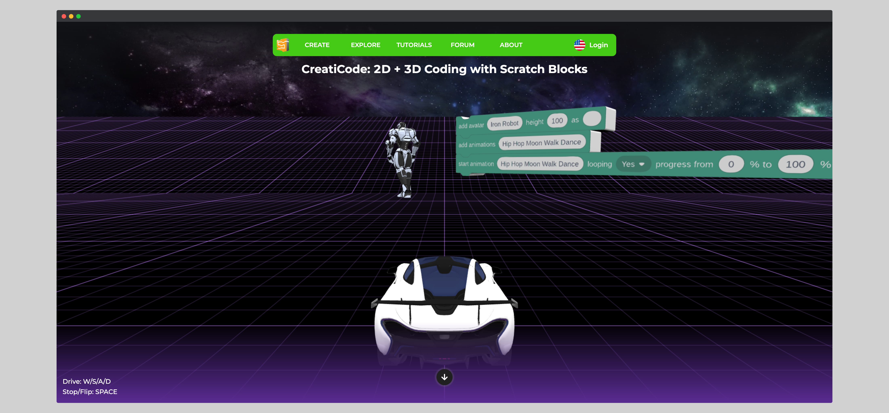
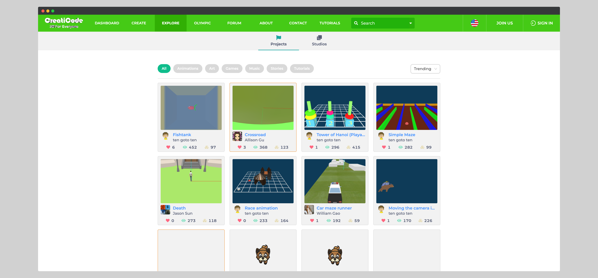
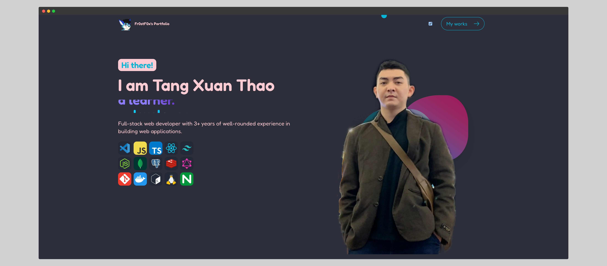
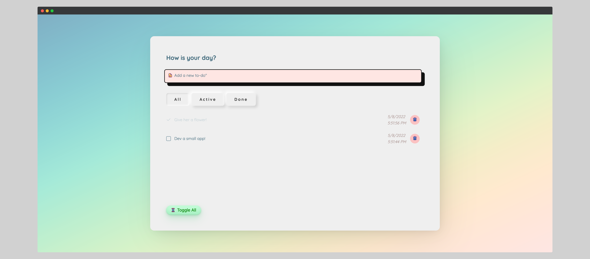

## My work - Fr0stF0x

---

### Zigvy Corporation

[Creaticode](https://creaticode.com)

### ANTS Programmatic

[ADX](https://platform.a1digihub.com/v3)

*Campaign dashboard*

[Antalyser](https://antalyser.ants.vn/#/report/design/8454135147/view)

*Data aggregation and automated reporting tools*

Monitor system
<!---
(https://adx.ants.vn/logging/v3.1/#)
-->

*Tool for monitor entire system*

---

### Side projects

[Portfolio](https://fr0stf0x.vercel.app/)

[eslint-plugin-absolute-imports-only](https://www.npmjs.com/package/eslint-plugin-absolute-imports-only)

*A (zero-dependency!) eslint plugin that enforces absolute imports on your codebase.*

[eslint-config-padding-spacing](https://www.npmjs.com/package/eslint-config-padding-spacing)

*A (zero-dependency!) eslint config including padding and spacing practices that will make your code look better.*

[TakeAetoN](https://takeaeton.vercel.app/)

*Small todo app built with ViteJS, ReactJS and react-spring*

[Svelte animated form](https://svelte-animated-form.netlify.app/)

*Animated form with password meter using Svelte*

[fr0stf0x's Tech blog](https://beconfident.me)

*My tech blogs about Dev, JavaScript Ecosystem, Functional Programming*

[Workcation](https://workcations.netlify.app/)

*TailwindCSS and VueJS combined to a gorgeous app*

[Bright Hotel](https://bright-hotel.beconfident.me)

*School project for managing a hotel system with gorgeous design*

[Github jobs crawler](https://jobs.beconfident.me/)

*Use Github's Job API and NodeJS, Cronjob, Redis, ReactJS to fetch and render junior jobs posted on Github every 1 hour*

[VS Code on self-hosted server](https://code-server.beconfident.me/)

* Bring favorite IDE VSCode to my personal server
* I can *Code on any machines*

---

Page template forked from <a href="https://github.com/evanca/quick-portfolio">evanca</a>

